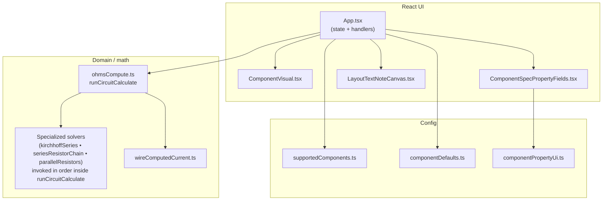
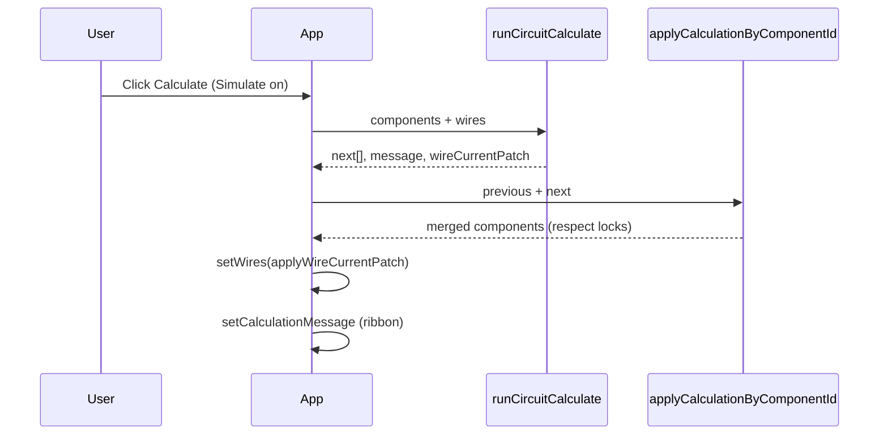
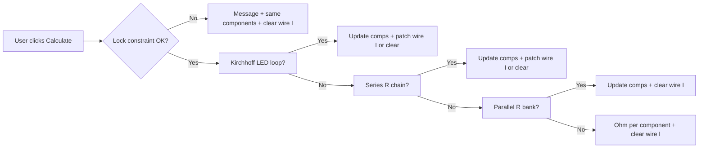

<div align="center">

# **crkt-dsn**

### Interactive schematic layout & DC circuit helper

*React + TypeScript • Vite • Canvas-style grid editor*

[](https://nodejs.org/)

</div>

---

## Summary

**crkt-dsn** is a browser app for **drawing simple DC circuits** on a snap grid: place batteries, resistors, LEDs, and capacitors; connect them with **orthogonal wires**; add **sticky text notes** for documentation; and optionally run **Simulate** mode with **Calculate** to fill voltages, currents, and resistances using **Ohm’s law** and a small set of **Kirchhoff-style** solvers (series loops, parallel resistor banks). **Wire-segment currents** on the canvas appear only when **`runCircuitCalculate`** returns a **`uniformSeries`** `WireCurrentPatch` (typical for Kirchhoff / series-R loops when branch current is inferred); otherwise the patch is **`clear`** and per-wire `currentA` is null (including parallel-only solves and pure per-component Ohm fallback).

The UI is a **single-page layout**: a top **toolbar** for tools and actions, a large **scrollable canvas**, and a **right-hand properties / export drawer**. State lives in React (`App.tsx`); there is **no backend**—everything runs in the client.

> **Goal of this README:** Give a human or an AI agent enough context to navigate the repo, extend components/solvers, and understand every major UI action and code area without guessing.

---

## Table of contents

1. [Features at a glance](#features-at-a-glance)
2. [Quick start](#quick-start)
3. [Tech stack](#tech-stack)
4. [High-level architecture](#high-level-architecture)
5. [User interface reference](#user-interface-reference)
   - [Toolbar (header)](#toolbar-header)
   - [Canvas](#canvas)
   - [Properties & export drawer](#properties--export-drawer)
6. [Simulation & calculation](#simulation--calculation)
7. [Data model](#data-model)
8. [Project structure](#project-structure)
9. [Source map (files & responsibilities)](#source-map-files--responsibilities)
10. [Configuration & constants](#configuration--constants)
11. [Extending the application](#extending-the-application)
12. [Scripts](#scripts)
13. [Keeping this README accurate (maintenance)](#keeping-this-readme-accurate-maintenance)

---

## Features at a glance

| Area | What you get |
|------|----------------|
| **Parts** | Battery, resistor, LED (color + Vf/If defaults), capacitor |
| **Wiring** | Orthogonal polylines with draggable bend handles |
| **Layout** | Grid snap, drag parts, rotate 90°, keyboard nudge |
| **Notes** | Resizable text notes with optional header & typography |
| **Analysis** | Simulate + Calculate: Ohm’s law, series LED loop, resistor chains, parallel banks |
| **Locks** | Per-part “lock electrical properties” for constrained solves |
| **Export** | PNG, JPEG, or PDF (A4) via `html2canvas` + `jspdf` |

---

## Quick start

```bash
git clone <your-fork-or-repo-url> crkt-dsn
cd crkt-dsn
npm install
npm run dev
```

Open the URL Vite prints (usually `http://localhost:5173`).

```bash
npm run build    # Typecheck + production bundle → dist/
npm run preview  # Serve dist locally
npm run lint     # ESLint
```

**Requirements:** Node **18+** recommended (matches current ecosystem for Vite 8 / React 19).

---

## Tech stack

| Layer | Choice |
|--------|--------|
| UI | React 19, TypeScript |
| Build | Vite 8, `@vitejs/plugin-react` |
| Styling | Global CSS (`src/styles.css`) |
| Raster export | `html2canvas` |
| PDF export | `jspdf` (dynamic import in `export/pdfLayout.ts`) |

---

## High-level architecture

The app is intentionally **flat**: almost all behavior is orchestrated from `App.tsx`. Specialized logic is split into **config**, **circuit math**, **geometry**, **export**, and **utils** so solvers and UI stay testable in isolation.



`runCircuitCalculate` tries **one** specialized topology at a time (Kirchhoff LED loop → series resistor chain → parallel bank); if none apply, it falls back to **per-component** Ohm’s law via the internal helper **`runOhmsCalculate`** in `ohmsCompute.ts` (not exported).

**State flow (simplified):**



In **`App.tsx`** these steps run inside the **Calculate** `setComponents` updater (same tick): `runCircuitCalculate` → `setWires(applyWireCurrentPatch)` → return `applyCalculationByComponentId`; the ribbon message is queued with `queueMicrotask`. The diagram order is **logical**, not every microtask boundary.

If **lock validation fails**, `runCircuitCalculate` returns the **unchanged** component list and **`wireCurrentPatch: clear`** (wire currents are cleared), so the ribbon shows the error and previous wire `currentA` values are wiped.

---

## User interface reference

### Toolbar (header)

The header is `header.toolbar` inside `App.tsx`. Actions are **left to right** after the brand wordmark.

| Control | Behavior |
|---------|----------|
| **Brand** (`CrktDsnWordmark`) | Visual identity only |
| **Battery / Resistor / LED / Capacitor** | **Placement tools** (toggle). Active tool highlights. Click again to deactivate (`none`). Click **canvas** to place a part at the snapped pointer position. New parts get ids from `createComponentId` (`B_1`, `R_1`, …). |
| **Wire** | **Routing mode.** Click a **terminal** (component end) to start; click **empty canvas** to add **90° orthogonal** waypoints; click a **second terminal** to finish. Same terminal cancels. |
| **Text note** | Click canvas to drop a new note (`N_1`, …). |
| **Delete** | Removes the **current selection**: a component (and attached wires), a wire, or a text note. Disabled when nothing selected. Always runs **`clearPlacementTool`** first, so an in-progress **wire draft** is cleared whenever Delete is used. |
| **Simulate** | Toggles **simulation mode** (disabled if there are no components **and** no wires). When turning **off**, clears the calculation message. Resets animation progress when toggling. |
| **Calculate** | **Only enabled when Simulate is on.** Runs `runCircuitCalculate` on the full component list and wires, merges results by id, updates wire currents when applicable, and shows a **message ribbon** (expand/collapse/close). |
| **Export** | Calls **`setShowExportPanel(true)`** (export form), **`setIsPropertiesDrawerOpen(true)`** (drawer), clears selection ids, resets filename to empty and format to **PNG**. |
| **Clear** | Confirms, then **removes everything** on the canvas (components, wires, notes), resets simulation UI, **resets id counters** (`resetLayoutEntityIdCounters`), and scroll position. |

**Keyboard (global, when not typing in inputs):**

| Key | Action |
|-----|--------|
| **Delete** | Same as **Delete** button for selection |
| **Arrow keys** | Nudge **selected component** or **selected text note** by one grid step (`GRID_SIZE`) |

---

### Canvas

| Interaction | Result |
|---------------|--------|
| **Click empty area** | Deselects (or adds wire bend / places part depending on tool) |
| **Drag component** | Moves with grid snap; wires follow terminal geometry |
| **Click component** | Selects; if **Wire** tool: start/complete connection |
| **Click wire** | Selects wire; shows bend **handles** when selected |
| **Drag bend handle** | Moves a waypoint (snapped) |
| **Rotate handle** (when component selected) | +90° clockwise per click |
| **Simulate + path** | Animated dot travels along BFS path from battery `right` to `left` terminal |
| **Simulate + Calculate** | Under-component labels show V/I/R per `componentPropertyUi`; wires show **branch current** only when the active solver applies a **uniform series** current patch (not for parallel-topology solves). |

---

### Properties & export drawer

The drawer can be **collapsed** with the chevron. Selecting a **component** or **text note** sets the drawer **open** (see `useEffect` on selection in `App.tsx`); selecting a **wire** alone does not auto-open the drawer—use the tab button if it was closed. **Persistence:** `localStorage` key `crkt-dsn-properties-drawer` is written on every open/close change: **`'1'`** when open, **`'0'`** when closed. On first load, the drawer starts **open** only if the stored value is already `'1'` (see `App.tsx`).

#### When **Export layout** is active (after toolbar **Export**)

| Field | Purpose |
|-------|---------|
| **Hint paragraph** | Explains default basename, formats, and crop behavior |
| **File name** | Optional; empty → `EXPORT_DEFAULT_BASENAME` (`crkt-export`) |
| **Format** | `PNG`, `JPEG`, or **PDF (A4)** |
| **Export** | Runs `html2canvas` with crop from `exportCrop.ts`, then download |
| **Cancel** | Closes export mode |

#### **Text note** selected

| Field | Purpose |
|-------|---------|
| **Note ID** | Read-only (`N_*`) |
| **Show header bar** | Toggles title strip |
| **Header** | Text, size, bold/italic (when header on) |
| **Width / Height** | Clamped via `clampTextNoteSize` |
| **Body** | Font size, bold/italic, multiline **textarea** |

#### **Wire** selected (no component/note)

| Field | Purpose |
|-------|---------|
| **Wire ID** | Read-only |
| **Endpoints** | `componentId:side → componentId:side` |
| **Branch current** | In Simulate, after Calculate, when the patch was **`uniformSeries`** (otherwise `currentA` stays empty / cleared). |

#### **Component** selected

| Field | Purpose |
|-------|---------|
| **Component ID** | Read-only; ties to DOM id `layout-component-{id}` |
| **Lock electrical properties** | Toggles `propertiesLocked`; when locked, **locked fields** are preserved on merge (see `componentLock.ts`) |
| **Lock hint** | Explains **exactly one unlocked** part when mixed lock state |
| **Component** | Read-only kind name |
| **Spec fields** | Rendered by `ComponentSpecPropertyFields` from `COMPONENT_PROPERTY_UI` |

Per-kind **visible fields** (design vs simulate) are centralized in `config/componentPropertyUi.ts`:

| Kind | Design panel | Simulate panel | Notes |
|------|----------------|----------------|--------|
| **Battery** | Voltage | Voltage | Canvas can also show **current** after calculate |
| **Resistor** | Resistance | Resistance | Canvas can show **V, I, R** in simulate |
| **LED** | Color, V, I | Same | No resistance field; LED uses color defaults from `componentDefaults.ts` |
| **Capacitor** | Capacitance | Capacitance | |

---

## Simulation & calculation

1. **Simulate** enables visualization (animated charge flow **when a battery and closed graph path exist**) and enables **Calculate**.
2. **Calculate** runs `runCircuitCalculate` (`circuit/ohmsCompute.ts`), which:
   - Validates **lock rules** (`validateCalculateLockConstraint`).
   - Tries **specialized topologies** in order:
     1. `tryKirchhoffSeriesBatteryLedResistor` — classic battery → LED → resistor loop
     2. `trySeriesResistorChain` — series resistors
     3. `tryParallelResistorsBank` — parallel resistor topology
   - Falls back to **per-component Ohm’s law** (`computeOhmsForComponent`) for each part.
3. Results merge into the live layout with `applyCalculationByComponentId` (`utils/componentIdentity.ts`), respecting **locks** via `mergeLockedComponentWithCalculated` (`utils/componentLock.ts`).
4. **`applyWireCurrentPatch`** (`circuit/wireComputedCurrent.ts`) runs **on every** Calculate click after `runCircuitCalculate` returns (see `App.tsx`): the patch is either **`{ type: 'clear' }`** (nulls all wire `currentA` — lock failure, solver error, parallel solve, Ohm fallback, or series solve when branch **I** can’t be inferred) or **`{ type: 'uniformSeries', currentA }`** when a series solver supplies a uniform loop current.



---

## Data model

Core types live in `src/types/circuit.ts`:

- **`CircuitComponent`** — `id`, `kind`, `x`, `y`, `rotationDeg`, `ledColor`, electric scalars (`voltage`, `current`, `resistance`, `capacitance`), `propertiesLocked`.
- **`Wire`** — `from` / `to` **`TerminalRef`** (`componentId` + `left` | `right`), `waypoints[]`, optional `currentA`.
- **`LayoutTextNote`** — decorative annotations; **not** part of the electrical graph.

**ID conventions** (`ids/layoutEntityIds.ts`):

| Entity | Pattern | Source |
|--------|---------|--------|
| Battery | `B_n` | prefix from `supportedComponents` |
| Resistor | `R_n` | |
| LED | `L_n` | |
| Capacitor | `C_n` | |
| Wire | `W_n` | `WIRE_ID_PREFIX` |
| Text note | `N_n` | `TEXT_NOTE_ID_PREFIX` |

---

## Project structure

```text
crkt-dsn/
├── public/                 # Static assets (e.g. favicon.svg)
├── src/
│   ├── App.tsx             # Main shell: state, toolbar, canvas, drawer
│   ├── main.tsx            # React root
│   ├── styles.css          # Global styles
│   ├── types/
│   │   └── circuit.ts      # CircuitComponent, Wire, Tool, notes
│   ├── config/
│   │   ├── index.ts        # Barrel exports
│   │   ├── supportedComponents.ts  # Kinds, labels, default locks, id prefixes
│   │   ├── componentDefaults.ts    # LED Vf/If table, battery default, LED colors
│   │   └── componentPropertyUi.ts  # Which fields appear in properties/canvas
│   ├── constants/
│   │   ├── layout.ts       # GRID_SIZE, canvas mins, text note sizing
│   │   ├── labels.ts       # toolLabels, kindLabels
│   │   ├── ledVisuals.ts   # LED_COLOR_HEX for SVG strokes
│   │   └── export.ts       # default export basename, limits
│   ├── ids/
│   │   ├── layoutEntityIds.ts      # createComponentId, createWireId, …
│   │   └── index.ts
│   ├── circuit/
│   │   ├── ohmsCompute.ts          # runCircuitCalculate orchestration
│   │   ├── electricUtils.ts        # Rounding / “is value set” helpers
│   │   ├── kirchhoffSeries.ts
│   │   ├── seriesResistorChain.ts
│   │   ├── parallelResistors.ts
│   │   ├── graphUtils.ts           # Terminal keys, adjacency helpers
│   │   ├── circuitConnectivity.ts  # isCircuitFullyConnected (not imported by App/solvers yet)
│   │   └── wireComputedCurrent.ts  # Patch wire.currentA from solve
│   ├── geometry/
│   │   ├── componentTerminals.ts   # World positions, hit testing
│   │   ├── orthogonalPaths.ts      # Orthogonal expansion for wires
│   │   └── polyline.ts             # Path interpolation (sim dot)
│   ├── export/
│   │   ├── exportCrop.ts           # Bounding box + scroll crop
│   │   ├── html2canvasLayout.ts    # Snapshot options
│   │   └── pdfLayout.ts            # jsPDF download helper
│   ├── utils/
│   │   ├── componentIdentity.ts    # get/patch/applyCalculationByComponentId
│   │   ├── componentLock.ts        # LOCKED_SPEC_FIELD_KEYS, merge rules
│   │   ├── componentValueText.ts   # Under-symbol label strings
│   │   ├── parse.ts                # parseNumberOrNull
│   │   ├── keyboardCanvas.ts       # Ignore keys when editing inputs
│   │   ├── gridNavigation.ts       # Arrow-key deltas
│   │   ├── layoutTextNote.ts       # Defaults & clamp for notes
│   │   ├── terminal.ts             # terminalKey string helper
│   │   └── exportFile.ts           # sanitizeExportBaseName
│   └── components/
│       ├── brand/CrktDsnWordmark.tsx
│       ├── canvas/                 # Tool icons, visuals, notes, ribbon icons
│       └── properties/ComponentSpecPropertyFields.tsx
├── eslint.config.js
├── index.html
├── package.json
├── tsconfig*.json
├── vite.config.ts
└── README.md
```

---

## Source map (files & responsibilities)

### Entry & shell

| File | Role |
|------|------|
| `main.tsx` | Mounts `<App />` and global CSS |
| `App.tsx` | **Single source of truth** for UI state: tools, selection, components, wires, notes, simulate, calculation ribbon, export, drawer; wires SVG + hit targets; simulation path BFS |
| `styles.css` | Layout grid, toolbar, canvas, drawer, forms |

### Configuration

| File | Role |
|------|------|
| `supportedComponents.ts` | **Add a new component kind here first** — drives `ComponentKind`, toolbar order, id prefixes, default lock |
| `componentDefaults.ts` | Placement defaults; **LED Vf/If by color** (reference table); `LED_COLOR_OPTIONS` |
| `componentPropertyUi.ts` | Property panel field lists; hints; optional extra canvas fields in simulate mode |

### Circuit analysis

| File | Role |
|------|------|
| `ohmsCompute.ts` | Orchestrates solvers + fallback Ohm; returns messages + wire patch |
| `kirchhoffSeries.ts` | Battery + LED + resistor series loop |
| `seriesResistorChain.ts` | Multi-resistor series |
| `parallelResistors.ts` | Parallel bank solver |
| `graphUtils.ts` | Terminal key enumeration / graph helpers |
| `circuitConnectivity.ts` | `isCircuitFullyConnected` — graph connectivity helper (**currently unused** by `App` / solvers; safe to wire in later) |
| `wireComputedCurrent.ts` | Applies **`WireCurrentPatch`**: clear all `currentA`, or set uniform **I** on valid inter-part wires |
| `electricUtils.ts` | Numeric guards and rounding |

### Geometry & drawing

| File | Role |
|------|------|
| `componentTerminals.ts` | Maps component `x,y`, `rotationDeg` → terminal world coords |
| `orthogonalPaths.ts` | Builds Manhattan polyline through waypoints |
| `polyline.ts` | Distance along path — **simulation dot** position |

### Export

| File | Role |
|------|------|
| `exportCrop.ts` | Computes diagram bounds + visible crop rect |
| `html2canvasLayout.ts` | Shared `html2canvas` options |
| `pdfLayout.ts` | Embeds raster in A4 PDF |

### Utilities

| File | Role |
|------|------|
| `componentIdentity.ts` | Id-safe patches; **merge calculate results**; re-exports `isComponentPropertiesLocked` |
| `componentLock.ts` | **Authoritative** lock field lists + validation |
| `componentValueText.ts` | Formats under-component value line |
| `parse.ts`, `keyboardCanvas.ts`, `gridNavigation.ts` | Small UX helpers |
| `layoutTextNote.ts` | Resolved note fields with defaults |
| `terminal.ts` | `terminalKey` for graph edges |
| `exportFile.ts` | Safe filename for downloads |

### React components

| File | Role |
|------|------|
| `ComponentVisual.tsx` | SVG schematic for each `kind` |
| `ToolIcons.tsx` | Toolbar icons per `Tool` |
| `LayoutTextNoteCanvas.tsx` | Note UI on canvas (resize, edit) |
| `ComponentSpecPropertyFields.tsx` | Dynamic inputs for V/I/R/C/color |
| `RibbonIcons.tsx`, `DrawerIcons.tsx` | Drawer/ribbon chrome |

---

## Configuration & constants

| Symbol | Location | Meaning |
|--------|----------|---------|
| `GRID_SIZE` | `constants/layout.ts` | Snap & keyboard nudge step (px) |
| `COMPONENT_WIDTH` / `HEIGHT` | `constants/layout.ts` | Footprint for terminals & hit tests |
| `CANVAS_MIN_*` | `constants/layout.ts` | Minimum scrollable canvas size |
| `TEXT_NOTE_*` | `constants/layout.ts` | Note sizing & font bounds |
| `EXPORT_DEFAULT_BASENAME` | `constants/export.ts` | Default download name |
| `LED_DEFAULTS_BY_COLOR` | `componentDefaults.ts` | **Vf (V)** and **If (A)** for LED colors |
| `LOCKED_SPEC_FIELD_KEYS` | `utils/componentLock.ts` | Which fields user “owns” when locked |
| `COMPONENT_PROPERTY_UI` | `config/componentPropertyUi.ts` | Properties panel & canvas labeling rules |

---

## Extending the application

1. **New component kind**  
   - Add to `SUPPORTED_CIRCUIT_COMPONENTS` in `supportedComponents.ts`.  
   - Add defaults in `componentDefaults.ts` (if needed).  
   - Extend `CircuitComponent` in `types/circuit.ts` if new fields are required.  
   - Add `COMPONENT_PROPERTY_UI` row + `LOCKED_SPEC_FIELD_KEYS`.  
   - Draw it in `ComponentVisual.tsx` and add a `ToolIcon`.

2. **New solver / topology**  
   - Follow the pattern in `kirchhoffSeries.ts` / `seriesResistorChain.ts` / `parallelResistors.ts`: return `{ applicable: false }` when not your topology; on success return `next` plus an **`explanation`** string (Kirchhoff) or the shape the sibling file uses; on failure use **`message`**.  
   - Insert a branch in `runCircuitCalculate` **before** the Ohm fallback.  
   - Update `wireComputedCurrent` if branch currents should display (uniform series solvers use `uniformSeries`; parallel path currently clears wire currents in `ohmsCompute.ts`).

3. **UI-only changes**  
   - Prefer editing `componentPropertyUi.ts` and `constants/labels.ts` instead of scattering strings.

---

## Scripts

| Script | Command |
|--------|---------|
| Dev server | `npm run dev` |
| Production build | `npm run build` |
| Preview build | `npm run preview` |
| Lint | `npm run lint` |

---

## Keeping this README accurate (maintenance)

**Full audit (Mar 2026):** Cross-checked against `package.json`, every file under `src/`, and the Calculate / wire-patch path in `App.tsx` + `circuit/ohmsCompute.ts` + `circuit/wireComputedCurrent.ts`.

**Why earlier reviews kept finding “new” issues:** The README is long and **behavior is concentrated** in a few files (especially `App.tsx` and `runCircuitCalculate`). Earlier passes often fixed **structure** (file lists) first; **execution order** (e.g. `applyWireCurrentPatch` on every Calculate, lock failure clearing wires) and **dead code** (`circuitConnectivity.ts` unused) only show up when those files are read line-by-line. That is normal for docs—**not** a sign the project was wrong.

**When you change code, update README sections:**

| Change in | Update in README |
|-----------|------------------|
| `package.json` deps / scripts | [Tech stack](#tech-stack), [Scripts](#scripts), [Quick start](#quick-start) |
| Toolbar, drawer, export, keyboard | [Toolbar](#toolbar-header), [Properties & export drawer](#properties--export-drawer) |
| `runCircuitCalculate` / solvers / patches | [Simulation & calculation](#simulation--calculation), [Summary](#summary), flowcharts |
| New / removed `src/**` files | [Project structure](#project-structure), [Source map](#source-map-files--responsibilities) |
| New component kind / defaults / UI fields | [Extending](#extending-the-application), [Configuration & constants](#configuration--constants) |

---

## License

When you open-source this project, add a `LICENSE` file at the repository root and update this section.

---

<div align="center">

**crkt-dsn** — *sketch circuits, reason about DC behavior, export clean diagrams.*

</div>
